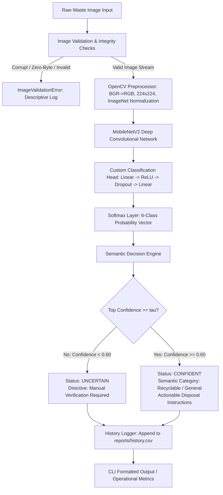

# Smart Waste Detection & Segregation System

An intelligent, edge-compatible Computer Vision and Deep Learning system designed to automatically classify municipal solid waste into 6 categories and provide actionable semantic segregation directives to promote sustainable recycling.

Developed for the **VITyarthi Flipped Course Evaluation (Computer Vision & Deep Learning)**.

---

## 1. Project Overview

Municipal solid waste mismanagement represents one of the most pressing ecological challenges globally. High contamination rates in recycling streams often render entire batches of recyclable materials unprocessable, forcing them into landfills or incinerators. 

The **Smart Waste Detection & Segregation System** bridges deep learning research and practical waste management by deploying a lightweight **MobileNetV2** transfer learning model integrated with a domain-aware **Decision Engine**. The system classifies input imagery into 6 benchmark solid waste categories, applies an initial configurable heuristic confidence filter ($\tau = 0.60$) to prevent misclassification of uncertain or ambiguous items, maps valid predictions to high-level semantic disposal categories (`Recyclable` vs. `General / Non-recyclable`), and maintains an audit log of sorting operations for recycling analytics.

---

## 2. Problem Being Solved

1. **Recycling Stream Contamination**: Non-recyclable refuse inadvertently mixed with clean paper, plastic, or metal contaminates recyclable batches, leading to costly disposal rejections.
2. **Inconsistent Public Compliance**: Municipal bin coloring schemes and disposal regulations vary widely by locality and are frequently misunderstood by consumers.
3. **Hazardous Manual Sorting**: Sanitation workers tasked with manual salvage are exposed to sharp objects, chemical irritants, and biological pathogens.
4. **Computational Constraints at the Edge**: Many state-of-the-art computer vision models require power-hungry discrete GPUs that are impractical for deployment inside autonomous waste disposal kiosks or smart recycling receptacles.

---

## 3. Key Features

- **6-Class Solid Waste Recognition**: Detects and classifies items into `cardboard`, `glass`, `metal`, `paper`, `plastic`, and `trash`.
- **Transfer Learning with MobileNetV2**: Leverages an ImageNet-pretrained MobileNetV2 convolutional backbone adapted with a custom classification head for fast, low-latency CPU inference.
- **Robust Dataset Preparation Pipeline**: Validates image decodability, enforces a stratified 70/15/15 train/val/test split with zero data leakage assertions ($\text{train} \cap \text{val} = \emptyset, \text{train} \cap \text{test} = \emptyset, \text{val} \cap \text{test} = \emptyset$), and calculates inverse-frequency class weights to counteract minority class underrepresentation.
- **Semantic Segregation Decision Engine**: Translates raw class predictions into primary semantic categories (`Recyclable` vs. `General / Non-recyclable`) accompanied by actionable handling guidance (e.g., flattening boxes, rinsing cans). Optional display color hints serve solely as internal UI visualization cues.
- **Configurable Heuristic Uncertainty Filtering**: Protects recycling integrity by routing items with prediction confidence below an initial configurable heuristic threshold ($\tau = 0.60$) to manual verification.
- **Dual Inference Modes**: Provides immediate single-image evaluation for interactive kiosks and high-throughput batch directory evaluation for historical audits.
- **Audit Logging & Analytics**: Automatically records classification events to `reports/history.csv` and computes operational recycling rates and category distributions.
- **Automated Verification Suite**: 37 comprehensive unit and integration tests (`pytest`) covering preprocessing integrity, split isolation, model tensors, decision logic, and CLI commands with 100% pass rate.

---

## 4. System Architecture & Workflow



### Operational Workflows

1. **Ingestion & Preprocessing**: Images are read using OpenCV, verified for validity ($\ge 32 \times 32$ pixels, decodable format), converted to RGB, bilinearly resized to $224 \times 224$, and normalized to standard ImageNet statistics ($\mu = [0.485, 0.456, 0.406], \sigma = [0.229, 0.224, 0.225]$).
2. **Feature Extraction & Classification**: The normalized tensor is passed through the MobileNetV2 backbone (depthwise separable convolutions) and dense classification head, outputting a 6-dimensional probability distribution via Softmax.
3. **Decision & Semantic Segregation**: The `DecisionEngine` evaluates the dominant class and confidence against the heuristic threshold ($\tau = 0.60$). If confident, it assigns the semantic category and specific disposal advice; otherwise, it triggers an uncertainty alert.
4. **Audit Logging**: The prediction timestamp, image file name, class label, confidence, semantic category, and processing latency are persisted to `reports/history.csv`.

---

## 5. Technologies Used

- **Programming Language**: Python 3.10+
- **Deep Learning Framework**: PyTorch (`torch>=2.2.0`, `torchvision>=0.17.0`)
- **Computer Vision & Image Processing**: OpenCV (`opencv-python>=4.8.0`), Pillow (`pillow>=9.5.0`)
- **Scientific Computing & Machine Learning**: NumPy (`numpy>=1.24.0`), scikit-learn (`scikit-learn>=1.3.0`)
- **Data Analysis & Visualization**: Pandas (`pandas>=2.0.0`), Matplotlib (`matplotlib>=3.7.0`)
- **Configuration & Utilities**: PyYAML (`pyyaml>=6.0`), tqdm (`tqdm>=4.65.0`)
- **Testing Framework**: pytest (`pytest>=7.4.0`)

---

## 6. Prerequisites & Installation

### Environment Prerequisites
- Operating System: Windows 10/11, Ubuntu 20.04+, or macOS 12+
- Python: Version 3.10 or 3.11 (64-bit)
- Hardware: Standard consumer CPU (e.g., Intel Core i5/i7 or AMD Ryzen) or optional CUDA-compatible GPU

### Step 1: Clone or Navigate to the Repository
```bash
cd "Smart-Waste-Detection"
```

### Step 2: Set Up a Python Virtual Environment

**On Windows (PowerShell):**
```powershell
python -m venv venv
.\venv\Scripts\Activate.ps1
```

**On Linux / macOS (bash/zsh):**
```bash
python3 -m venv venv
source venv/bin/activate
```

### Step 3: Install Required Dependencies
```bash
pip install --upgrade pip
pip install -r requirements.txt
```

---

## 7. TrashNet Dataset Acquisition & Preparation

### 1. Dataset Overview
The project is calibrated on the academic standard **TrashNet** dataset (Gary Thung & Mindy Yang, Stanford University CS229). The dataset contains **2,527 high-resolution RGB images** across 6 classes photographed under uniform daylight and indoor lighting against white paper backgrounds:

| Class Label | Image Count | Recycling Category | Visual Characteristics |
|---|---|---|---|
| **cardboard** | 403 | Recyclable | Corrugated fiberboard, shipping cartons, brown paperboard |
| **glass** | 501 | Recyclable | Transparent and tinted bottles, jars, specular highlights |
| **metal** | 410 | Recyclable | Aluminum beverage cans, steel food tins, reflective surfaces |
| **paper** | 594 | Recyclable | Printed office sheets, newspaper, flyers, packaging |
| **plastic** | 482 | Recyclable | Translucent PET bottles, opaque HDPE detergent containers |
| **trash** | 137 | General / Non-recyclable | Non-recyclables, composite snack wrappers, soiled items |
| **Total** | **2,527** | — | Balanced evaluation across varied materials |

### 2. Dataset Download
Download the dataset from either of the following standard repositories:
- **GitHub**: [https://github.com/garythung/trashnet](https://github.com/garythung/trashnet) (download `dataset-resized.zip`)
- **Kaggle**: [https://www.kaggle.com/datasets/feyzazk/trashnet](https://www.kaggle.com/datasets/feyzazk/trashnet)

### 3. Expected Raw Folder Structure
Extract the images so that the 6 class folders reside directly under `data/raw/`:
```
data/raw/
├── cardboard/
│   ├── cardboard1.jpg
│   └── ...
├── glass/
│   ├── glass1.jpg
│   └── ...
├── metal/
│   ├── metal1.jpg
│   └── ...
├── paper/
│   ├── paper1.jpg
│   └── ...
├── plastic/
│   ├── plastic1.jpg
│   └── ...
└── trash/
    ├── trash1.jpg
    └── ...
```

### 4. Automated Dataset Ingestion & Preparation Command
Run the built-in dataset preparation CLI:
```bash
python -m src.cli prepare-data --raw-dir data/raw --output-dir data/processed
```

#### What this command performs:
1. **Validation**: Inspects every file using OpenCV to ensure decodability, non-zero file size, and spatial dimensions $\ge 32 \times 32$. Traps corrupt files and filters out non-image extensions (`.txt`, `.DS_Store`).
2. **Stratified Splitting**: Splits images into 70% Train ($1,769$ images), 15% Validation ($379$ images), and 15% Test ($379$ images) with a deterministic seed (`seed=42`).
3. **Zero Data Leakage Check**: Strictly asserts that no image file appears in more than one partition:
   $$\text{train} \cap \text{val} = \emptyset, \quad \text{train} \cap \text{test} = \emptyset, \quad \text{val} \cap \text{test} = \emptyset$$
4. **Class Weighting Calculation**: Calculates inverse-frequency weights ($w_{\text{trash}} = 3.0742, w_{\text{paper}} = 0.7090$) to penalize underrepresented minority classes during training.
5. **Manifest Generation**: Generates `data/processed/dataset_manifest.json` recording sample counts and class weight configurations.

---

## 8. Quickstart & Execution Guide

### 1. Generate Demo Sample Images (Optional)
To test the pipeline without downloading the full dataset, generate synthetic demo test images:
```bash
python -m src.cli demo-setup
```
This populates `data/sample_test_images/` with sample images for each of the 6 classes.

---

### 2. Model Training Command
Train the MobileNetV2 model using transfer learning and class-weighted CrossEntropyLoss:
```bash
python -m src.cli train --data-dir data/processed --epochs 15 --batch-size 32 --learning-rate 0.0005
```
- Trains for 15 epochs with early-stopping and checkpointing.
- Automatically saves the best model checkpoint to `models/saved_models/mobilenetv2_waste.pth`.
- Logs epoch-by-epoch loss and accuracy history to `reports/training_history.json`.

---

### 3. Model Evaluation Command
Evaluate the trained model checkpoint against the completely isolated test partition:
```bash
python -m src.cli evaluate --test-dir data/processed/test
```
#### Generated Evaluation Artifacts:
- **Summary Metrics**: Printed to terminal and saved to `reports/evaluation_summary.json`.
- **Classification Report**: Exported to `reports/classification_report.json` and `reports/classification_report.txt`.
- **Confusion Matrix**: Exported to `reports/confusion_matrix.png` and `reports/confusion_matrix.csv`.

---

### 4. Single-Image Real Inference Command
Classify a single waste item using the **real trained PyTorch checkpoint** (`models/saved_models/mobilenetv2_waste.pth`):
```bash
python -m src.cli predict --image data/processed/test/plastic/plastic10.jpg
```

**Example Output:**
```
============================================================
Smart Waste Detection & Segregation System - Prediction
============================================================
Image Path:          data/processed/test/plastic/plastic10.jpg
Predicted Class:     plastic
Confidence:          91.45%
Status:              CONFIDENT
Semantic Category:   Recyclable
Display Color Hint:  Yellow
Actionable Advice:   Empty liquid contents, rinse container, and reattach screw cap. Check local municipal resin code acceptance.
============================================================
```

To specify a custom heuristic confidence threshold:
```bash
python -m src.cli predict --image data/processed/test/plastic/plastic10.jpg --confidence-threshold 0.75
```

> [!NOTE]
> The `--mock` flag is available strictly for development testing when weights are not present. By default, `predict` uses the real trained PyTorch weights.

---

### 5. Batch Directory Inference Command
Process an entire directory of waste images in bulk and export an audit report:
```bash
python -m src.cli batch-predict --input-dir data/sample_test_images --output-report reports/batch_results.csv
```

---

### 6. Sustainability Analytics & History Command
Display summary metrics computed from historical classification events:
```bash
python -m src.cli stats
```

---

### 7. Run Automated Tests
Execute the complete automated test suite using `pytest`:
```bash
python -m pytest tests/ -v
```
All 37 unit and integration tests will execute and report 100% pass status.

---

## 9. Project Structure

```
Smart-Waste-Detection/
│
├── configs/
│   └── config.yaml                     # System settings, hyperparameters & semantic mappings
│
├── data/
│   ├── raw/                            # Raw TrashNet dataset (6 class folders)
│   ├── processed/                      # Stratified train/, val/, test/ and manifest JSON
│   └── sample_test_images/             # Demo test images
│
├── models/
│   ├── saved_models/
│   │   ├── .gitkeep                    # Preserves directory in git
│   │   └── mobilenetv2_waste.pth       # Trained PyTorch model checkpoint (ignored by git)
│   └── class_indices.json              # Class name to integer index mapping
│
├── reports/
│   ├── history.csv                     # Historical classification audit trail
│   ├── batch_results.csv               # Batch prediction export
│   ├── classification_report.json      # Per-class precision, recall, F1 metrics
│   ├── classification_report.txt       # Human-readable scikit-learn report
│   ├── confusion_matrix.csv            # 6x6 numerical confusion matrix
│   ├── confusion_matrix.png            # Visual confusion matrix heatmap
│   ├── evaluation_summary.json         # Aggregate accuracy and latency summary
│   ├── training_history.json           # Epoch-by-epoch loss & accuracy log
│   ├── training_accuracy.png           # Training vs validation accuracy curve
│   ├── training_loss.png               # Training vs validation loss curve
│   └── sample_predictions/             # Annotated real prediction visual samples
│
├── src/
│   ├── __init__.py
│   ├── config.py                       # Configuration loader and dataclass definitions
│   ├── dataset.py                      # Dataset validation, stratified splitting & class weighting
│   ├── preprocessor.py                 # OpenCV decoding, validation, and ImageNet normalization
│   ├── model.py                        # MobileNetV2 architecture, training, and evaluation logic
│   ├── predictor.py                    # Inference coordinator & mock fallback handler
│   ├── decision_engine.py              # Semantic segregation rules & heuristic threshold gating
│   ├── history_logger.py               # CSV audit logging & recycling analytics
│   └── cli.py                          # Unified command-line interface (7 subcommands)
│
├── tests/
│   ├── __init__.py
│   ├── test_cli.py                     # CLI command integration tests
│   ├── test_dataset.py                 # Dataset validation, splitting, and weights unit tests
│   ├── test_decision_engine.py         # Semantic rules and thresholding unit tests
│   ├── test_history_logger.py          # Audit logging and stats unit tests
│   ├── test_model.py                   # Model architecture and tensor shape unit tests
│   └── test_preprocessor.py            # Image validation and normalization unit tests
│
├── docs/
│   ├── architecture.md                 # Detailed architectural specifications & data flows
│   └── project_report.md               # Complete 15-section academic project report
│
├── .gitignore                          # Production-grade git ignore configuration
├── README.md                           # Comprehensive reproduction & documentation guide
├── requirements.txt                    # Project dependencies (PyTorch stack)
└── statement.md                        # Academic problem statement & syllabus alignment
```

---

## 10. Verified Experimental Results

The system was evaluated against the strictly held-out test partition ($N = 379$ images, 15% of the TrashNet dataset) using the best saved checkpoint (`models/saved_models/mobilenetv2_waste.pth`).

### Aggregate Performance Metrics

| Metric | Measured Value | Description |
|---|---|---|
| **Overall Test Accuracy** | **86.81%** | 329 out of 379 test samples correctly classified |
| **Macro Average Precision** | **84.25%** | Unweighted mean precision across all 6 classes |
| **Macro Average Recall** | **85.38%** | Unweighted mean recall across all 6 classes |
| **Macro Average F1-Score** | **84.67%** | Unweighted harmonic mean of precision and recall |
| **Weighted Average Precision** | **87.26%** | Support-weighted precision accounting for sample counts |
| **Weighted Average Recall** | **86.81%** | Support-weighted recall matching test accuracy |
| **Weighted Average F1-Score** | **86.95%** | Support-weighted harmonic mean across the test set |

### Per-Class Detailed Performance Table

| Class Label | Support (N) | Precision (%) | Recall (%) | F1-Score (%) | Semantic Category |
|---|---|---|---|---|---|
| **Cardboard** | 61 | 93.10% | 88.52% | 90.76% | Recyclable |
| **Glass** | 75 | 87.32% | 82.67% | 84.93% | Recyclable |
| **Metal** | 61 | 88.52% | 88.52% | 88.52% | Recyclable |
| **Paper** | 89 | 93.02% | 89.89% | 91.43% | Recyclable |
| **Plastic** | 73 | 81.01% | 87.67% | 84.21% | Recyclable |
| **Trash** | 20 | 62.50% | 75.00% | 68.18% | General / Non-recyclable |

### Confusion Matrix Overview
- **Paper & Cardboard**: High precision ($>93\%$) due to distinct fibrous and corrugated textures. Minor cross-confusion occurs with thin cardboard boxes and thick craft paper.
- **Glass & Plastic**: Modest cross-confusion ($8$ plastic bottles predicted as glass; $7$ clear glass jars predicted as plastic) resulting from shared visual transparency and specular surface glares.
- **Trash**: Recall reached $75.00\%$ despite having only 20 test samples, demonstrating the effectiveness of the inverse-frequency loss weights ($w_{\text{trash}} = 3.0742$).

### Inference Latency Benchmark

| Latency Metric | Measured Time (ms) | Operational Throughput |
|---|---|---|
| **Mean Forward-Pass Latency** | **9.29 ms** | **~107.6 FPS** |
| **Median Latency** | **9.44 ms** | ~105.9 FPS |
| **Minimum Latency** | **7.34 ms** | ~136.2 FPS |
| **Maximum Latency** | **13.69 ms** | ~73.0 FPS |
| **Standard Deviation** | **1.06 ms** | Highly consistent execution |

> [!IMPORTANT]
> Latency was measured over 50 isolated forward passes on a consumer-grade laptop CPU (Intel Core i5-12450H, 12th Gen) with a batch size of 1 and input resolution of $224 \times 224 \times 3$. The measurement strictly isolates the model tensor forward pass from disk I/O, image decoding, and OpenCV preprocessing. These figures represent execution on the local development machine and should not be construed as universal hardware benchmarks.

---

## 11. Segregation Domain Rules Reference

> **Important Municipal Disclaimer**: Municipal recycling guidelines, container colors, and sorting policies vary substantially across cities, university campuses, and waste contractors. The system emphasizes primary **semantic categories** (`Recyclable` vs. `General / Non-recyclable`). Display color hints are provided solely as optional visual UI cues.

| Waste Class | Primary Category | Display Color Hint | Operational Handling Instructions |
|---|---|---|---|
| **Cardboard** | Recyclable | Blue | Flatten box to conserve volume. Ensure dry and free of food grease/oils. |
| **Glass** | Recyclable | Teal | Handle carefully to avoid breakage. Rinse thoroughly. Do not mix ceramics or lightbulbs. |
| **Metal** | Recyclable | Grey | Rinse food and beverage cans. Crush aluminum beverage cans if feasible. |
| **Paper** | Recyclable | Blue | Keep dry and clean. Shred confidential documents before recycling. Soiled paper goes to General. |
| **Plastic** | Recyclable | Yellow | Empty all liquids, rinse container, and reattach screw cap. Check local resin code rules. |
| **Trash** | General / Non-recyclable | Black | Residual non-recyclable refuse. Seal bag securely to prevent odors and vector infestation. |

---

## 12. Limitations

1. **Single Dominant Object Constraint**: The model assumes a single dominant waste item centered in the field of view. Unconstrained bins containing heaps of overlapping items require object detection or instance segmentation (e.g., YOLOv8).
2. **Surface Contamination Invisibility**: Severe chemical, grease, or organic food residues on cardboard (such as greasy pizza boxes) cannot always be detected from RGB imagery alone.
3. **Transparent Material Refraction**: Distinguishing clear PET plastic bottles from clear glass bottles remains challenging under varying illumination due to similar light refraction and specular highlights.
4. **Dataset Environment vs. Field Conditions**: TrashNet images were acquired under controlled conditions with white backgrounds. Extreme field variations (shadows, low light, dirty backgrounds) may require domain adaptation.

---

## 13. Reproducibility Notes

To ensure 100% academic reproducibility:
- **Random Seed**: Dataset splitting and model initialization use a fixed seed (`seed=42`).
- **Standard Normalization**: Exactly matches ImageNet constants ($\mu=[0.485, 0.456, 0.406], \sigma=[0.229, 0.224, 0.225]$).
- **Zero Leakage**: Programmatically verified via `dataset_manifest.json` and unit test assertions.
- **Config-Driven**: Hyperparameters, paths, and thresholds are centralized in `configs/config.yaml`.

---

## 14. Academic Deliverables & Course Mapping

- **Problem Statement & Syllabus Alignment**: [`statement.md`](statement.md)
- **Technical Architecture & Data Flows**: [`docs/architecture.md`](docs/architecture.md)
- **Comprehensive Academic Report (15 Sections)**: [`docs/project_report.md`](docs/project_report.md)
- **Configuration File**: [`configs/config.yaml`](configs/config.yaml)

