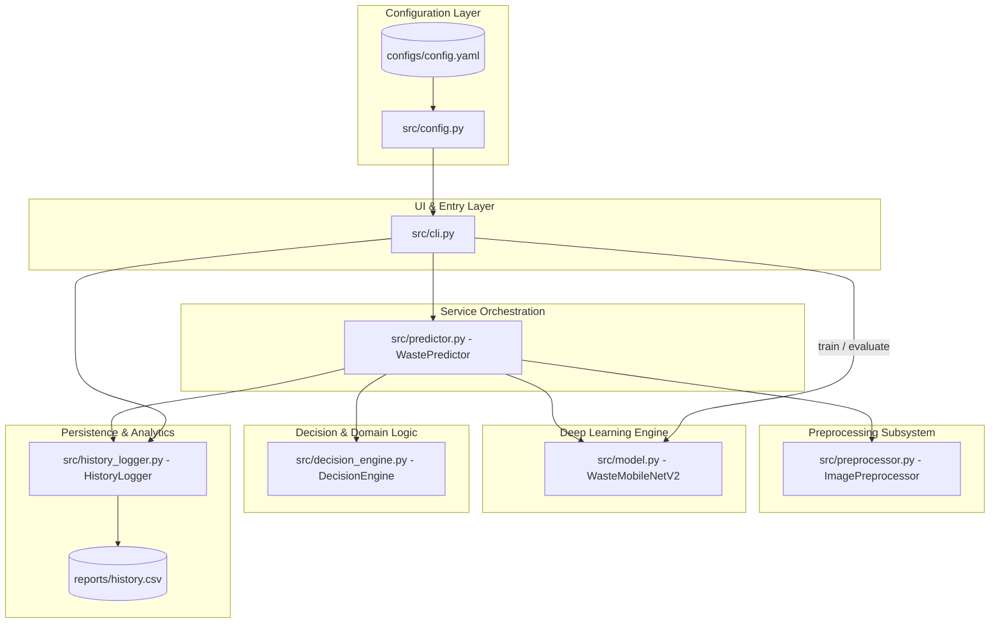
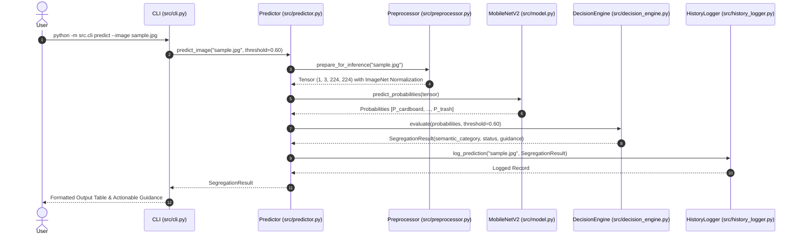

# System Architecture & Technical Design

**Project**: Smart Waste Detection & Segregation System  
**Course**: VITyarthi Flipped Course Evaluation (Computer Vision)  

---

## 1. High-Level Architecture Overview

The Smart Waste Detection & Segregation System follows a decoupled, modular architecture adhering to the **Single Responsibility Principle (SRP)**. The design cleanly separates configuration, input handling, image preprocessing, deep learning inference, rule-based segregation logic, training routines, persistence, and command-line interfaces.

---

## 2. Component Breakdown

### 2.1 Configuration Subsystem (`src/config.py`)
- Reads project settings, model hyperparameters, file paths, and semantic segregation rules from `configs/config.yaml`.
- Uses typed Python dataclasses (`ModelConfig`, `SegregationRule`, `SystemConfig`) for reliable schema verification.
- Automatically locates project root across variable terminal working directories.

### 2.2 Dataset Management & Preparation Subsystem (`src/dataset.py`)
- Implements `DatasetManager` for reliable dataset validation, class imbalance mitigation, and stratified splitting.
- **Validation Pipeline**:
  - Confirms existence of all 6 expected class folders (`cardboard`, `glass`, `metal`, `paper`, `plastic`, `trash`).
  - Scans files using OpenCV buffer decoding to ensure files are valid, non-empty, and $\ge 32 \times 32$.
  - Ignores unsupported files (`.txt`, `.pdf`, `.DS_Store`) and logs corrupted images.
- **Class Imbalance Mitigation**:
  - Calculates balanced inverse-frequency weights:
    $$w_c = \frac{N_{\text{total}}}{K \cdot N_c}$$
  - Passes tensor weights to `nn.CrossEntropyLoss(weight=weights)` to counteract class frequency disparities (such as `trash` with 137 samples vs `paper` with 594).
- **Stratified Partitioning**:
  - Deterministically partitions data into 70% train, 15% val, and 15% test with a fixed random seed (`seed=42`).
  - Enforces zero data leakage across partitions ($\text{train} \cap \text{val} = \emptyset$, $\text{train} \cap \text{test} = \emptyset$, $\text{val} \cap \text{test} = \emptyset$).
  - Emits `dataset_manifest.json` recording sample distributions, class weights, and validation diagnostics.

### 2.3 Image Preprocessing & Validation Subsystem (`src/preprocessor.py`)
- Implements `ImagePreprocessor` utilizing OpenCV.
- Enforces validation guards:
  - File existence and non-zero byte size verification.
  - Extension whitelisting (`.jpg`, `.jpeg`, `.png`, `.bmp`, `.webp`).
  - Byte decoding verification (catching corrupted/unreadable files).
  - Minimum spatial resolution validation ($\ge 32 \times 32$).
- **Transformation Pipeline (Standardized for MobileNetV2)**:
  1. Reads image and converts BGR to RGB color space (`cv2.COLOR_BGR2RGB`).
  2. Resizes spatial dimensions to $224 \times 224$ via bilinear interpolation.
  3. Converts to float32.
  4. Scales pixel values to $[0.0, 1.0]$ by dividing by $255.0$.
  5. Applies standard ImageNet normalization:
     $$\text{normalized} = \frac{\text{pixel} - \text{mean}}{\text{std}}, \quad \text{mean}=[0.485, 0.456, 0.406], \quad \text{std}=[0.229, 0.224, 0.225]$$
  6. Transposes to channel-first tensor `(1, 3, 224, 224)` for PyTorch.

### 2.4 Deep Learning Engine (`src/model.py`)
- Implements `WasteMobileNetV2`, utilizing transfer learning.
- **Feature Extractor**: MobileNetV2 pre-trained on ImageNet. Backbone convolutional layers are frozen initially to preserve fundamental visual representations.
- **Classification Head**:
  $$\text{GlobalAveragePooling2D} \rightarrow \text{Dropout}(0.3) \rightarrow \text{Linear}(1280 \rightarrow 128) \rightarrow \text{ReLU} \rightarrow \text{Dropout}(0.2) \rightarrow \text{Linear}(128 \rightarrow 6)$$
- **Training Pipeline (`train_model`)**:
  - Implements dataset loading via `torchvision.datasets.ImageFolder` with identical ImageNet normalization.
  - Automatically loads partitioned `train/` and `val/` directories or performs random split.
  - Incorporates class-weighted `nn.CrossEntropyLoss` and `optim.Adam`.
  - Best-model checkpoint preservation based on validation accuracy.
- **Evaluation (`evaluate_and_generate_reports`)**:
  - Calculates confusion matrix and classification reports using `scikit-learn`.

### 2.5 Decision & Segregation Engine (`src/decision_engine.py`)
- Maps multi-class probability distributions into semantic disposal categories:
  - **Primary Categories**: `Recyclable` vs. `General / Non-recyclable`.
  - **Optional Display Color Hints**: `display_color_hint` (e.g. Blue, Teal, Grey, Yellow, Black) is treated strictly as an internal visualization attribute, noting that municipal physical bin coloring rules vary regionally.
- **Initial Configurable Heuristic Threshold**:
  - Compares top prediction confidence against an initial heuristic threshold $\tau$ (default $0.60$).
  $$\text{Status} = \begin{cases} \text{CONFIDENT} & \text{if } \max(P) \ge \tau \\ \text{UNCERTAIN} & \text{if } \max(P) < \tau \end{cases}$$
  - If `UNCERTAIN`, the item is routed to *"Manual Verification Required"* to prevent recycling stream contamination.

### 2.6 Audit Logger & Analytics (`src/history_logger.py`)
- Appends each classification record to `reports/history.csv`.
- Generates summary statistics: total classifications, recycling rates, class frequency percentages, and average confidence scores.

### 2.7 CLI Application Interface (`src/cli.py`)
- Exposes user subcommands:
  - `prepare-data`: Validates and partitions raw dataset into stratified train/val/test splits.
  - `predict`: Real-time single image evaluation.
  - `batch-predict`: High-throughput directory scanner.
  - `train`: Executes PyTorch transfer learning on waste image dataset.
  - `stats`: History and recycling performance metrics.
  - `demo-setup`: Generates synthetic demo images for testing.
  - `evaluate`: Computes confusion matrix and classification metrics on test sets.

---

## 3. Data Flow Diagram

